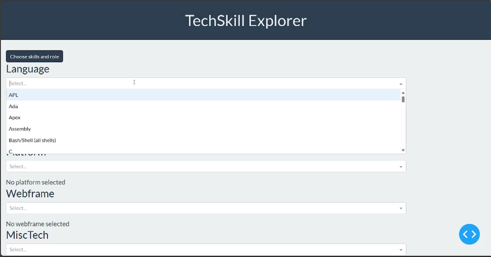
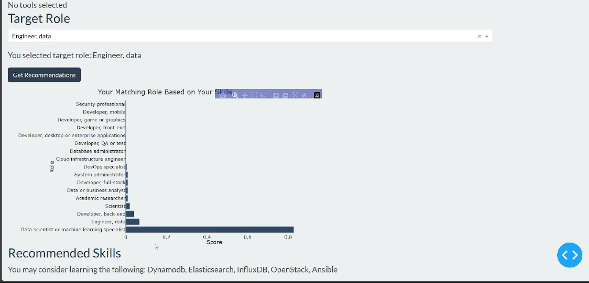
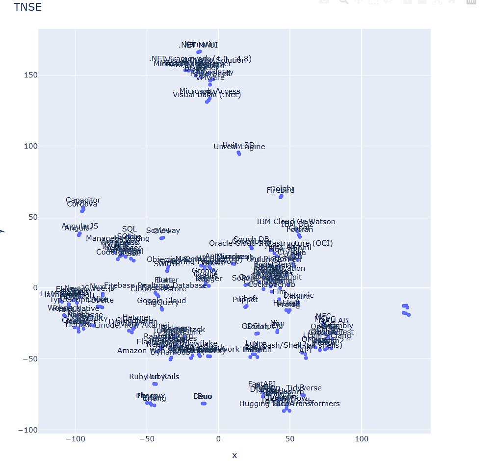

### Skill Pilot
============================== 

An end-to-end data science project that assists individuals in making informed decisions about their next steps in the software engineering industry.

All you have to do is to chose your current skills and choose your target role and then press the get recommendations button.
and boom the magic happens !

  
  
  

[Motivation](#motivations)
[Project Structure](#structure)
[Installation](#install )
[Data Preprocessing & Cleaning](#preprocessing )
[Exploratory Data Analysis (EDA)](#eda)
[Feature Engineering](#feature-engineering)
[Modeling](#modeling)
[Prediction and Dash Scripts](#scripts)
[Discussion](#disccusion )
[Tools and Technologies](#tools )
[Skills Demonstrated](#skills)
[Acknowledgments](#acknow )
[Contact Information](#contactn)

## Project Description

###  Motivation 
In the dynamic world of software, constantly changing languages, technologies, platforms, and frameworks can make it challenging for learners. The variety of technologies available might feel overwhelming at times.
You cant pick what to learn next and the worst is when you are making a career shift and you don't know from where to start

### Skill Pilot: Your Learning Advisor
Skill Pilot is designed to simplify the decision-making process for learners, providing tailored recommendations. It acts as a personalized guide, considering your current skills, and preferences to suggest the most suitable next steps in your learning path.

--------
##  <a name="structure">Project structure
- Notebooks folder : contains all the jupyter notebooks
- data folder contains 2 subfolders, one for the raw data and the other one for the proccessd data
- models : contains the mlflow outputs that keep track of each model
- reports contains the graph produced by plotly
- scripts : contains the scripts of the project

for the aim of the organizing the project i used the cookiecutter data science project template
[Cookiecutter Data Science Project Template](https://github.com/drivendata/cookiecutter-data-science)

## <a name="install">Installation
To run this project, you need:
    It's recommend to create ant activate a virtual environments before installing dependecies
1. Python 3
2. Jupyter Notebook installed
3. install differen packages on the requirements.txt
4. Clone the project 
5. Download the [Stackoverflow Yearly Suervey](https://survey.stackoverflow.co/) dataset (2023) and place it in the "raw data" folder
6. Run the notebooks in the "notebooks" folder sequentially
7. Finally run the Dash script
## Data
i used the stackoverflow yearly survey dataset (2023)
2 reasons for chosing it 
1. it's updated yearly so it's alwyas up to date
2. it's not focusing on a specific geopgrahical area, instead developers from all over the world participate in the suervey
[Stackoverflow Yearly Suervey](https://survey.stackoverflow.co/)

## <a name="preprocessing">Data Preprocessing & Cleaning
- Splitting multiple answers in a single column
- Correcting data types (e.g., years and age)
- Removing unwanted roles (e.g., Student, Designer)
- Balancing class differences using upsampling and downsampling
  
## <a name="eda">Exploratory Data Analysis (EDA)
- Utilized treemaps to visualize skill frequency across different categories (language, database, web framework, etc.)
- Created role vs. skill heatmap and normalized it
  

- Employed dendrogram for hierarchical clustering to identify relationships between different role classes
- Examined skill specificity to different roles
 

## <a name="feature-engineering">Feature Engineering
- Applied t-SNE to visualize high-dimensional data (250+ features)
   

- Conducted clustering using silhouette analysis
  

- Created new features based on these clusters.
  
  Results
  reducing the feature set from 250+ to 25 features
  improving the base model accuracy

## <a name="modeling">Modeling
- Developed a baseline model using a simple logistic regression
- Implemented a random forest classifier with PCA
- Fine-tuned the random forest model using grid search
- Saved models, parameters, and metrics using MLflow

## <a name="scripts">Prediction and Dash Scripts
- Created a script for preprocessing, predicting, and returning recommendations based on input skills and target roles
- Deployed the model using Dash from Plotly
  
## <a name="disccusion">Discussion
Main challenges involved extensive data preprocessing to ensure data quality and format.

## <a name="tools">Tools and Technologies
- MLflow for algorithm tracking
- Plotly and Matplotlib for visualization
- Pandas and NumPy for data handling
- Dash for model deployment
  
## <a name="skills">Skills Demonstrated
- Data manipulation and preprocessing
- Data cleaning
- Analytical thinking
- Effective visualizations
- Modeling and model deployement

## <a name="acknow">Acknowledgments

<small>Project based on the <a target="_blank" href="https://drivendata.github.io/cookiecutter-data-science/">cookiecutter data science project template</a>. #cookiecutterdatascience</small>

## <a name="contact">Contact Information
gad43617@gmail.com

[Linkedin Profile](https://www.linkedin.com/in/mohamed-gad-0808a41b3/)

